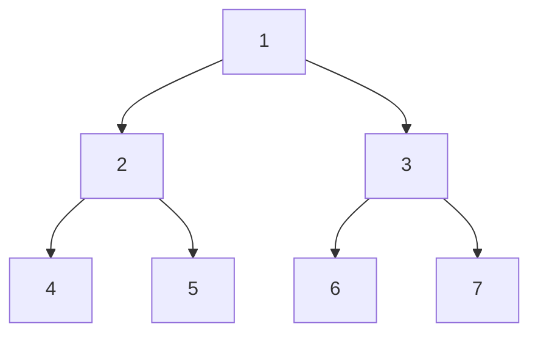

# Breadth-First Search
BFS is a common algorithm used to traverse and search _**a graph or a tree**_ data structure. It explores all the nodes at the current depth before moving on to nodes at the next depth.

Suppose we want to traverse the following graph using BFS:



The steps for BFS are as follows:
1. Start at the root node (1).
2. Visit the root node (1).
3. Enqueue all the neighbors (children) of the root node (2 and 3).
4. Dequeue the next node from the queue (2).
5. Visit the dequeued node (2).
6. Enqueue all the neighbors (children) of node 2 (4 and 5).
7. Dequeue the next node from the queue (3).
8. Visit the dequeued node (3).
9. Enqueue all the neighbors (children) of node 3 (6 and 7).
10. Dequeue the next node from the queue (4).
11. Visit the dequeued node (4).
12. Since node 4 does not have any neighbors, dequeue the next node from the queue (5).
13. Visit the dequeued node (5).
14. Since node 5 does not have any neighbors, dequeue the next node from the queue (6).
15. Visit the dequeued node (6).
16. Since node 6 does not have any neighbors, dequeue the next node from the queue (7).
17. Visit the dequeued node (7).
18. Since node 7 does not have any neighbors, the traversal is complete.
19. The BFS traversal of this graph would be: 1 -> 2 -> 3 -> 4 -> 5 -> 6 -> 7.

The **time complexity of BFS on a graph is O(V + E)**, where V is the number of vertices (nodes) and E is the number of edges. The **space complexity of BFS is O(V)**, as it requires a queue to store the visited nodes.

Here's a code example of BFS in JavaScript:

## Example

```javascript
const dimensionlessGraph = {
    a: ['b', 'd'],
    b: ['e'],
    c: ['f', 'g'],
    d: ['h'],
    e: ['i'],
    f: ['j'],
 }

const breadthFirstSearch (graph, start, end) => {
    let queue = []
    queue.push(start)

    while(queue.length) {
      const currentVertex = queue.shift()
      
      if (!graph[currentVertex]) {
        graph[currentVertex] = []
      }
      
      if (graph[currentVertex].includes(end)) {
        return true
      } else {
        queue = [...queue, ...graph[currentVertex]]
      }
    }
    
    return false
  }
```
