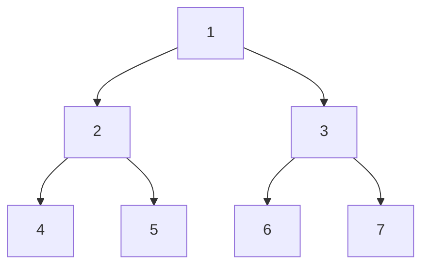

# Depth-First Search

**DFS** is a common algorithm used to traverse and search a _**graph or a tree**_ data structure.
It starts at a root node and explores as far as possible along each branch before backtracking.


Suppose we want to traverse this tree using DFS.
There are two variations of DFS - pre-order and post-order.
In this example, let's use pre-order DFS which visits the root node first,
then the left subtree, and finally the right subtree.
1. Start at the root node (1).
2. Visit the root node (1).
3. Traverse the left subtree:
   - a. Visit node 2.
   - b. Traverse the left subtree of node 2:
       - i. Visit node 4.
       - ii. Node 4 does not have any child nodes, so return to node 2.
   - c. Traverse the right subtree of node 2:
       - i. Visit node 5.
       - ii. Node 5 does not have any child nodes, so return to node 2.
   - d. Node 2 has no more unvisited child nodes, so return to node 1.
4. Traverse the right subtree:
   - a. Visit node 3.
   - b. Traverse the left subtree of node 3:
       - i. Visit node 6.
       - ii. Node 6 does not have any child nodes, so return to node 3.
   - c. Traverse the right subtree of node 3:
       - i. Visit node 7.
       - ii. Node 7 does not have any child nodes, so return to node 3.
   - d. Node 3 has no more unvisited child nodes, so return to node 1.
5. All nodes have been visited, so the traversal is complete.
The pre-order DFS traversal of this binary tree would be: 1 -> 2 -> 4 -> 5 -> 3 -> 6 -> 7.

The **time complexity of DFS on a binary tree is O(n)**, and the **space complexity ranges from O(log n) to O(n)**, depending on the shape of the tree

```javascript
/**
 * Definition for a binary tree node.
 * function TreeNode(val, left, right) {
 *     this.val = (val===undefined ? 0 : val)
 *     this.left = (left===undefined ? null : left)
 *     this.right = (right===undefined ? null : right)
 * }
 */
/**
 * @param {TreeNode} root
 * @return {number}
 */
const diameterOfBinaryTree = function(root) {
    let diameter = 0

    const depth = (node) => {
        if (!node) {
            return 0
        }

        const leftDepth = depth(node.left)
        const rightDepth = depth(node.right)

        diameter = Math.max(diameter, leftDepth + rightDepth)

        return Math.max(leftDepth, rightDepth) + 1
    }

    depth(root, 0)
    return diameter
}
```
